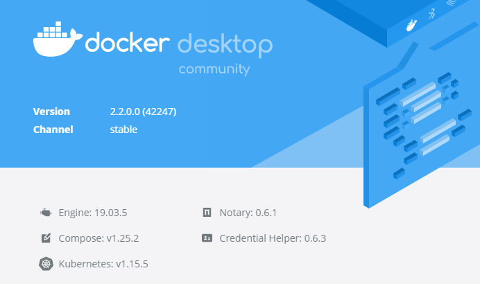

# raster2pdf-windowscore
Docker Windows Core container example running TerraGo Publisher for Raster

This project will outline installing and running TerraGo Publisher For Raster in a Docker Windows Server Core container.

## Requirements
This project was created in Windows 10 running Docker for Windows using Windows containers.



You will need the TerraGo Publisher for Raster installer which you should already have, but if you need access to the installer contact support@terragotech.com

## Setup
1. Copy **TerraGo_Publisher_for_Raster.exe** in to the root of this project
2. Build image

`docker build -t raster2pdf .`

3. Verify

`docker run --rm raster2pdf raster2pdf --version`

## Sample data
You can download some sample GeoTIFF files from [here](https://download.osgeo.org/geotiff/samples/).  I've included a file from the `/usgs/` folder with this project that are copied to `c:\app\data` inside the container.

## Running
Open a PowerShell window and go into the project folder and execute...

`docker run -it --rm -v "$(pwd)\assets\data:c:\app\data" raster2pdf c:\app\data\run.bat`

## Support
If you need help with this sample open an issue here on github or email jbfreels@terragotech.com

## licensing
By default, you'll get watermarks if you're unlicensed.  Included is a `PUB4R.xml` containing the IP address to a concurrent license server.
```xml
<?xml version="1.0" encoding="utf-8" standalone="yes" ?>
<Config>
    <licenseServer>192.168.1.70</licenseServer>
</Config>
```
Update the IP address to your license server.
